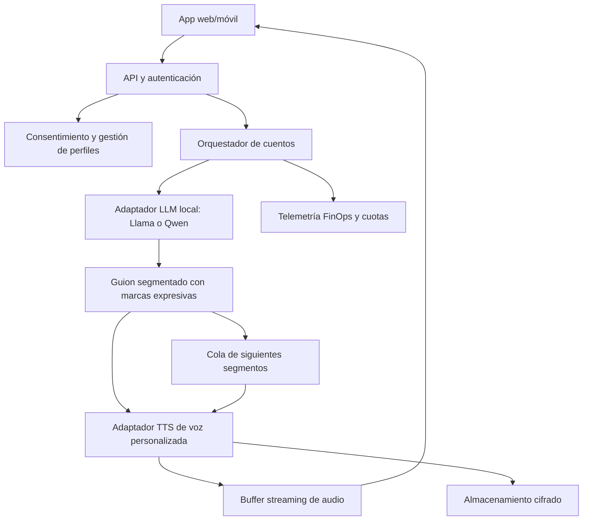

# Arquitectura técnica — propuesta v0.1

## Principios
SDD, arquitectura hexagonal, independencia de proveedor, inferencia autoalojada cuando sea viable, observabilidad y seguridad por diseño.

## Alternativas por evaluar
- LLM local: familias Llama y Qwen; comprobar licencias de versión y rendimiento.
- TTS: OpenVoice V2 y otros modelos con **licencias verificadas de código y pesos** para SaaS comercial.
- No asumir que XTTS v2 o F5-TTS preentrenados permiten uso comercial sin restricciones.
- Hardware: GPU caliente/compartida para latencia baja; medir ocupación y costo fijo.

## SLO propuestos, no garantizados
Primer audio <= 3 s, primera escena <= 5 s, p95 a medir bajo concurrencia y condiciones reales. Perfil de voz preparado durante onboarding, no durante cada reproducción.

## Guardrails
- Consentimiento expreso, verificación razonable de titularidad de voz, prohibición de clonación no autorizada.
- Aislamiento por tenant, cifrado, acceso mínimo, borrado de muestras y embeddings, auditoría.
- Evitar almacenar datos sensibles innecesarios de menores.
- Límites por sesión de tokens, duración, reintentos, GPU y costo.
- Moderación y revisión de contenidos adecuados para niños.
- Versionar modelos, prompts y evaluaciones.

## Decisiones pendientes
Modelo TTS comercialmente utilizable, benchmark de acento español/peruano, GPU objetivo, proveedor cloud, arquitectura de pagos, términos y política de privacidad.
